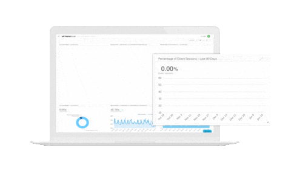

<h1 align="center">👋 Hi there, I’m Bùi Thu Hằng</h1>

  <i>Data Analyst</i>

  

## 🧭 What Guides My Work

I’m building my career in data analytics around a simple idea: **the quality of an analysis depends on how clearly the problem is defined before the first query is written**.

I focus on understanding the business context, working carefully with data, and turning analysis into insights that are clear, trustworthy, and useful for decision-making.

I’m currently expanding that foundation through VinUniversity’s **AI in Action** program, exploring how AI can support real-world analytics workflows.

> *“The goal is to turn data into information, and information into insight.”*  
> — Carly Fiorina

## 🧩 What I Build

### 📈 Analytics & BI

I build end-to-end analytics projects that move from raw data to structured datasets, analysis, and interactive dashboards.

The goal is not just to visualize numbers, but to make the underlying logic clear, trustworthy, and useful for business decisions.

### ⚙️ Data & AI

I’m also exploring how AI can support analytical workflows, from problem-solving and data preparation to faster experimentation and better decision support.

### 📝 How I Work

Across my projects, I focus on understanding the problem first, validating the data carefully, and documenting the process so others can review, reproduce, and build on the work.

## 🎨 Analytics Toolkit

  &nbsp;
  
  &nbsp;
  
  &nbsp;
  
  &nbsp;
  
  

## 🤝 Let's Connect

  

  

 

I’m happy to connect and exchange perspectives around **data, business, and decision-making**.

Whether you’re working on analytics or reporting, exploring a data-driven problem, building a team, or simply want to share ideas and experiences, I’d be glad to hear from you.

Conversations that bring together different perspectives are especially meaningful to me, whether they touch on analytics, business questions, products, technology, or continuous learning.

Feel free to reach out — there’s always something valuable to learn from a good conversation. Reach out through any of the platforms linked above.

## 🌱 Current Focus

* Building analytics projects that connect data with real business questions
* Exploring data quality, reporting, and decision-support through practical use cases
* Learning how AI can complement analytics and improve problem-solving workflows
* Expanding my perspective across business, product, and financial analytics
* Continuously improving how I communicate insights through data and visualization

---

  <i>Thanks for stopping by. Wishing you good ideas, meaningful work, and something new to learn along the way.</i>

